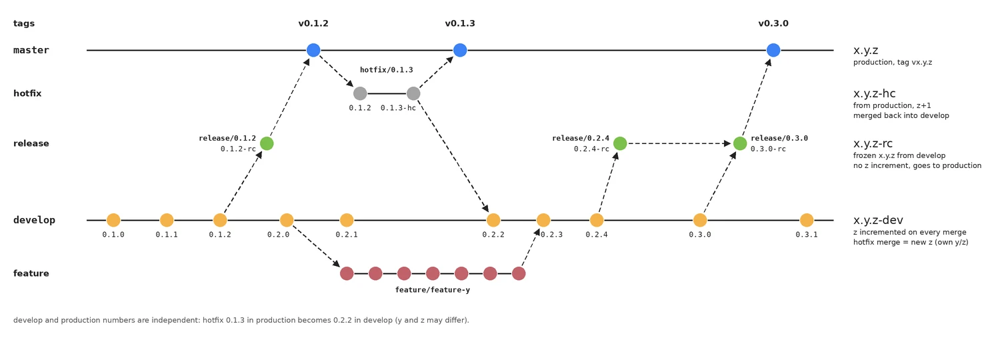

# Paths Games V1 - Step 02: Create the repository

This document defines the **create the repository** steps to build a **Paths Games**, an playable web-based game, with detailed requirements and scope for a V1 release.

1. Create the repository
    - ✅ Choose platform (GitHub / GitLab / self-hosted)
        > Platform is GitHub Repository, GitLab is the backup platform, CodeCommit is deprecated
    - ✅ Define final project name
        > **Paths Games**
    - ✅ Initialize an empty repository
        > Repository created [github.com/gamespaths/pathsgames](https://github.com/gamespaths/pathsgames)  
    - ✅ Set the main branch
        > Created main branch `master` used in production deployments  
        > Developers and agent will create `develop` and `feature` branch!  
        > Continuous integration system will create `release` and `hotfix` branch!  
        > Development steps is defined by schema:  
            

        > Versions are `x.y.z`; the suffix tells the branch, so the same number on two branches is not the same build.  
        >
        > | Branch | Version | Rule |
        > | --- | --- | --- |
        > | `develop` | `x.y.z-dev` | `z` +1 on every merge into develop (0.1.0 → 0.1.1 → 0.1.2); `y` can be bumped to start a new cycle (0.2.0) |
        > | `feature/*` | from develop | starts from develop, merges back into develop; the merge is a new develop `z` (feature starts at 0.2.0, merges back as 0.2.3) |
        > | `release/*` | `x.y.z-rc` | cut from develop with frozen `x.y.z` (release/0.1.2 from develop 0.1.2); `z` is never incremented; goes to production; never merges back into develop |
        > | `hotfix/*` | `x.y.z-hc` | starts from the production version (0.1.2), `z` +1 (0.1.3), goes to production and is always merged back into develop |
        > | `master` | `x.y.z` | production; every production version is tagged `vx.y.z` (v0.1.2, v0.1.3, v0.3.0) |
        >
        > - Tags exist only on `master`.  
        > - A release can be superseded by a later release: release/0.2.4 (from develop 0.2.4) does not go to production, it flows into release/0.3.0 (from develop 0.3.0), which is released as v0.3.0.  
        > - The hotfix back-merge increments the own `z` of develop (develop 0.2.1 → 0.2.2).  
        > - Develop and production numbers are independent: `y` and `z` may differ (production 0.1.3, develop 0.2.2).  
    - ✅ Define basic access rules
        > The project is public with GNU GPL V3 license

# Version Control
- First version not created with AI.
- **Document Version**: 0.8
    | Version | Description | Date |
    | --- | --- | --- |
    | 0.2 | first version of file with points list | February 2, 2026 |
    | 0.3 | added licence and version control sections | February 3, 2026 |
    | 0.4 | added branches image and definition | February 5, 2026 |
    | 0.7 | repository changend [github.com/gamespaths/pathsgames](https://github.com/gamespaths/pathsgames) | February 26, 2026 |
    | 0.42.0 | branching and versioning model description added | October 4, 2026 |
    
- **Last Updated**: October 4, 2026
- **Status**: Complete ✅

# &lt; Paths Games /&gt;
All source code and informations in this repository are the result of careful and patient development work by developer team, who has made every effort to verify their correctness to the greatest extent possible. If part of the code or any content has been taken from external sources, the original provenance is always cited, in respect of transparency and intellectual property.

Some content and portions of code in this repository were also produced with the support of artificial intelligence tools, whose contribution helped enrich and accelerate the creation of the material. Every piece of information and code fragment has nevertheless been carefully checked and validated with the goal of ensuring the highest quality and reliability of the provided content.

For all details, in-depth information, or requests for clarification, please visit [Paths.Games](https://paths.games/) website

## License
Made with ❤️ by <a href="https://github.com/gamespaths/pathsgames">paths.games dev team</a>
&bull; 
Public projects 

*Free Software!*

The software is distributed under the terms of the GNU General Public License v3.0. Use, modification, and redistribution are permitted, provided that any copy or derivative work is released under the same license. The content is provided "as is", without any warranty, express or implied.

Narrative Content & Assets: The story, dialogues, characters, sounds, musics, paint, all artist contents and world-building (located on /data folder) are NOT open source. They are licensed under Creative Commons Attribution-NonCommercial-NoDerivatives 4.0 (CC BY-NC-ND 4.0).

(ITA) Il software è distribuito secondo i termini della GNU General Public License v3.0. L'uso, la modifica e la ridistribuzione sono consentiti, a condizione che ogni copia o lavoro derivato sia rilasciato con la stessa licenza. Il contenuto è fornito "così com'è", senza alcuna garanzia, esplicita o implicita.
